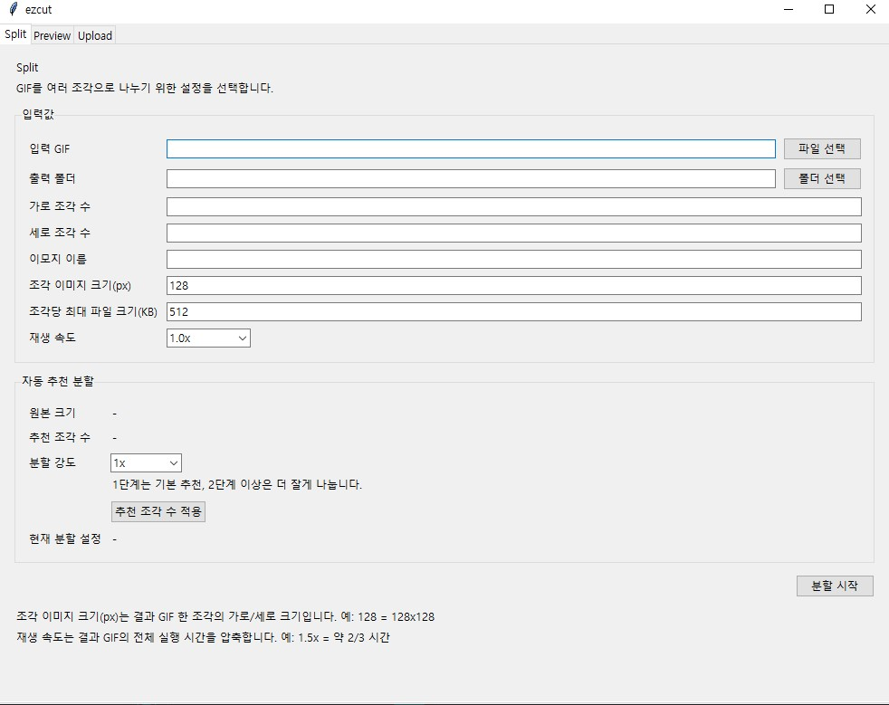
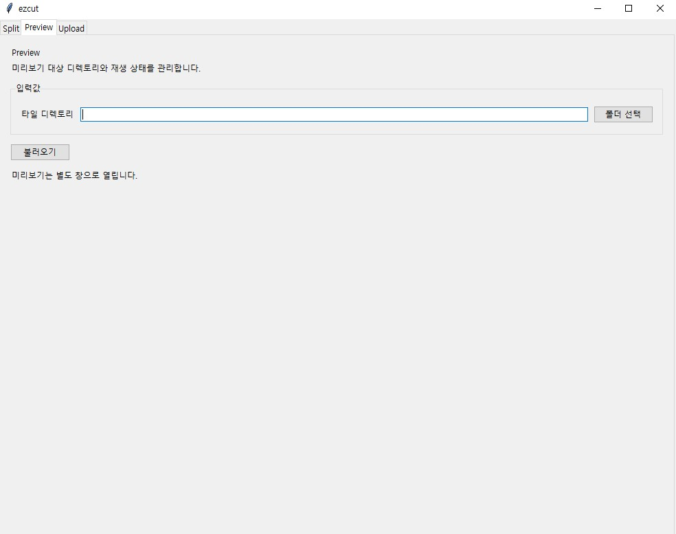
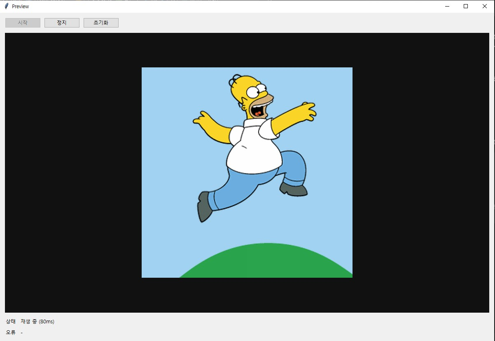
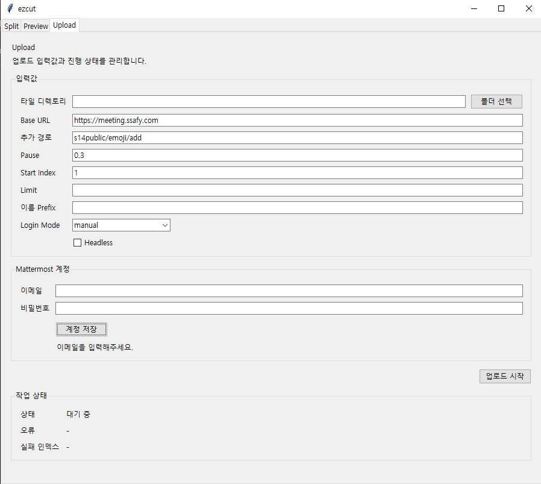

# ezcut GUI 가이드

## 목차

- [실행 방법](#실행-방법)
- [전체 흐름](#전체-흐름)
- [분할 결과 폴더](#분할-결과-폴더)
- [Split 탭](#split-탭)
- [Preview 탭](#preview-탭)
- [Upload 탭](#upload-탭)
- [Preview와 Upload의 공통점](#preview와-upload의-공통점)
- [추천 사용 순서](#추천-사용-순서)
- [자주 헷갈리는 부분](#자주-헷갈리는-부분)
- [한 줄 정리](#한-줄-정리)

`ezcut` GUI는 GIF를 잘라서 조각 GIF를 만들고, 만들어진 결과를 미리보기로 확인한 뒤, 같은 결과 폴더를 기준으로 업로드까지 진행할 수 있도록 만든 도구입니다.

## 실행 방법

프로젝트 루트에서 아래 명령으로 GUI를 실행합니다.

```powershell
uv sync
uv run ezcut-gui
```

## 전체 흐름

GUI 사용 흐름은 아래 순서로 보면 됩니다.

1. `Split` 탭에서 원본 GIF를 선택하고 분할 설정을 입력합니다.
2. 분할이 완료되면 원본 GIF가 있던 위치 기준으로 결과 폴더가 생성됩니다.
3. 결과 폴더 안에는 잘린 GIF 조각들과 `emoji.txt` 파일이 함께 생성됩니다.
4. `Preview` 탭에서는 이 결과 폴더를 선택해서 조각 GIF가 합쳐졌을 때 어떻게 보이는지 확인합니다.
5. `Upload` 탭에서도 같은 결과 폴더를 선택해서 업로드를 진행합니다.

즉, `Preview`와 `Upload`는 모두 `Split` 결과로 생성된 폴더를 대상으로 작업한다고 이해하면 됩니다.

## 분할 결과 폴더

원본 GIF를 자르면 기본적으로 원본 파일 이름 기준으로 `_pieces` 폴더가 생성됩니다.

예를 들어 원본 파일이 아래와 같다면:

```text
D:\work\sample.gif
```

기본 결과 폴더는 아래처럼 생성됩니다.

```text
D:\work\sample_pieces
```

이 폴더 안에는 다음과 같은 결과물이 들어갑니다.

- 잘린 조각 GIF 파일들
- `emoji.txt`

예시:

```text
sample_pieces/
  sample-a01.gif
  sample-a02.gif
  sample-a03.gif
  ...
  emoji.txt
```

이 결과 폴더를 그대로 `Preview` 탭과 `Upload` 탭에서 선택해서 사용하면 됩니다.

## Split 탭



`Split` 탭은 원본 GIF를 여러 개의 조각 GIF로 나누는 화면입니다.

> Notice
>
> 현재 기능 기준으로는 `조각 수`와 `분할 강도` 항목은 직접 조작하지 않는 것을 권장합니다.
> 기본 추천값을 사용하는 쪽이 가장 안정적이며, 특별한 이유가 없다면 자동 추천값을 그대로 적용해서 사용하는 것을 추천합니다.

### 주요 항목

- `입력 GIF`
  - 분할할 원본 GIF 파일 경로입니다.
  - `파일 선택` 버튼으로 GIF를 고를 수 있습니다.

- `출력 폴더`
  - 결과물이 저장될 폴더입니다.
  - 직접 지정하지 않으면 보통 원본 파일명 기준의 `_pieces` 폴더를 사용하게 됩니다.
  - 예: `sample.gif` -> `sample_pieces`

- `가로 조각 수`
  - 이미지를 가로로 몇 칸으로 나눌지 지정합니다.

- `세로 조각 수`
  - 이미지를 세로로 몇 칸으로 나눌지 지정합니다.

- `이모지 이름`
  - 결과 파일 이름 prefix로 사용됩니다.
  - 업로드 시 이름 규칙을 맞추고 싶을 때 유용합니다.

- `조각 이미지 크기(px)`
  - 각 조각 GIF의 가로/세로 크기입니다.
  - 예: `128`이면 조각 하나가 `128x128` 크기로 생성됩니다.

- `조각당 최대 파일 크기(KB)`
  - 각 조각 GIF의 최대 용량 제한입니다.
  - 용량 제한을 맞추기 위해 프레임 수나 속도에 영향을 줄 수 있습니다.

- `재생 속도`
  - 결과 GIF의 전체 재생 속도 배율입니다.
  - 예: `1.5x`는 더 빠르게 재생되도록 조정합니다.

### 자동 추천 분할

`Split` 탭 아래쪽에는 자동 추천 영역이 있습니다.

- `원본 크기`
  - 선택한 원본 GIF의 해상도입니다.

- `추천 조각 수`
  - 원본 비율을 보고 시스템이 추천하는 분할 수입니다.

- `분할 강도`
  - 추천 분할을 얼마나 더 잘게 나눌지 결정합니다.
  - `1x`: 기본 추천
  - `2x` 이상: 더 촘촘하게 분할

- `추천 조각 수 적용`
  - 추천값을 현재 분할 설정에 반영합니다.

### Split 탭에서 기억할 점

- 먼저 여기서 원본 GIF를 자릅니다.
- 잘린 결과는 폴더 단위로 관리됩니다.
- 이후 `Preview`와 `Upload`는 이 결과 폴더를 그대로 사용합니다.

## Preview 탭



`Preview` 탭은 분할된 결과를 다시 합쳐서 어떻게 보이는지 확인하는 화면입니다.

### 주요 항목

- `타일 디렉토리`
  - 분할 결과가 들어 있는 폴더를 지정합니다.
  - 여기에는 조각 GIF들과 `emoji.txt`가 함께 있어야 합니다.

- `폴더 선택`
  - 미리보기할 결과 폴더를 선택합니다.

- `불러오기`
  - 선택한 폴더를 읽어서 미리보기 창을 엽니다.

### Preview 팝업 예시



위 화면처럼 `Preview`는 별도 팝업 창으로 열리며, 분할된 조각 GIF를 다시 합쳐서 실제 전체 화면처럼 보이도록 재생해줍니다.

팝업 창에서는 아래 기능을 사용할 수 있습니다.

- `시작`
  - 미리보기 재생 시작
- `정지`
  - 현재 재생 중인 미리보기 정지
- `초기화`
  - 처음 프레임 기준으로 다시 되돌리기

하단 상태 영역에서는 현재 재생 상태와 오류 여부를 확인할 수 있습니다.

### Preview 탭에서 중요한 점

`Preview` 탭에는 원본 GIF를 넣는 것이 아니라, `Split` 결과 폴더를 넣습니다.

즉 아래처럼 이해하면 됩니다.

- `Split` 입력: 원본 GIF
- `Preview` 입력: `sample_pieces` 같은 결과 폴더

### 언제 사용하면 좋은가

- 조각이 잘 맞게 잘렸는지 확인하고 싶을 때
- 업로드 전에 전체 화면이 자연스럽게 이어지는지 확인하고 싶을 때
- `emoji.txt`와 조각 순서가 올바른지 점검하고 싶을 때

## Upload 탭



`Upload` 탭은 분할된 결과 폴더를 기준으로 업로드를 진행하는 화면입니다.

### 주요 항목

- `타일 디렉토리`
  - 업로드할 결과 폴더입니다.
  - `Preview`와 마찬가지로 `Split` 결과 폴더를 선택하면 됩니다.

- `Base URL`
  - 업로드 대상 서버의 기본 주소입니다.

- `추가 경로`
  - 실제 업로드 페이지 경로입니다.
  - `Base URL`과 합쳐서 업로드 페이지 주소를 만듭니다.

- `Pause`
  - 각 업로드 사이의 대기 시간입니다.
  - 서버 반응이나 브라우저 처리 시간을 고려해 너무 짧지 않게 두는 것이 좋습니다.

- `Start Index`
  - 결과 폴더 안 파일들 중 몇 번째부터 업로드를 시작할지 정합니다.
  - 일부만 다시 업로드할 때 유용합니다.

- `Limit`
  - 몇 개까지만 업로드할지 제한합니다.
  - 테스트 업로드할 때 유용합니다.

- `이름 Prefix`
  - 업로드 이름 앞에 붙일 접두어입니다.
  - 이름 규칙을 맞추고 싶을 때 사용합니다.

- `Login Mode`
  - 로그인 방식을 선택합니다.
  - `manual`: 사용자가 브라우저에서 직접 로그인
  - `auto`: 저장된 계정 정보를 사용해 자동 로그인 시도

- `Headless`
  - 브라우저를 화면 없이 실행할지 여부입니다.
  - 디버깅 중이면 보통 꺼두는 것이 확인하기 쉽습니다.

### Mattermost 계정 영역

- `이메일`
  - 자동 로그인에 사용할 계정 이메일입니다.

- `비밀번호`
  - 자동 로그인에 사용할 비밀번호입니다.

- `계정 저장`
  - 입력한 계정 정보를 저장합니다.
  - 이메일은 설정 파일에 저장되고, 비밀번호는 `keyring`을 통해 OS 자격 증명 저장소에 저장됩니다.

### Upload 탭에서 중요한 점

`Upload` 탭도 원본 GIF를 직접 받는 것이 아니라, `Split` 결과 폴더를 입력으로 받습니다.

즉 아래처럼 이해하면 됩니다.

- `Split`: 원본 GIF를 조각으로 생성
- `Preview`: 생성된 결과 폴더를 확인
- `Upload`: 생성된 결과 폴더를 업로드

> Notice
>
> `Start Index`와 `Limit`는 오류가 발생해서 일부 구간만 다시 업로드해야 하는 상황이 아니라면 조작하지 않는 것을 권장합니다.
> 기본값으로 전체 업로드를 진행하는 방식이 가장 안전합니다.
>
> `이름 Prefix`는 업로드 시 중복 이름 충돌을 피하기 위해 준비된 항목이지만, 이 값을 임의로 조작하면 `emoji.txt` 기반 이름 해석 흐름과 어긋날 수 있습니다.
> 특별한 이유가 없다면 `이름 Prefix`도 사용하지 않는 것을 권장합니다.

## Preview와 Upload의 공통점

`Preview`와 `Upload`는 둘 다 같은 입력 대상을 사용합니다.

둘 다 아래 폴더를 선택하면 됩니다.

```text
sample_pieces/
  sample-a01.gif
  sample-a02.gif
  ...
  emoji.txt
```

차이점은 목적입니다.

- `Preview`
  - 결과가 올바르게 잘렸는지 확인하는 용도
- `Upload`
  - 결과 폴더 안의 조각들을 실제 서비스에 올리는 용도

## 추천 사용 순서

가장 추천하는 사용 순서는 아래와 같습니다.

1. `Split` 탭에서 원본 GIF 선택
2. 분할 설정 확인 후 `분할 시작`
3. 생성된 `_pieces` 폴더 확인
4. `Preview` 탭에서 해당 폴더 선택 후 미리보기 확인
5. `Upload` 탭에서 같은 폴더 선택 후 업로드 진행

## 자주 헷갈리는 부분

### 1. Preview와 Upload에는 무엇을 넣어야 하나요?

원본 GIF가 아니라 `Split` 결과 폴더를 넣어야 합니다.

### 2. `_pieces` 폴더는 어디에 생기나요?

보통 원본 GIF가 있는 위치 기준으로 생성됩니다.

예:

```text
D:\work\sample.gif
-> D:\work\sample_pieces
```

### 3. `emoji.txt`는 왜 필요한가요?

분할 결과의 순서와 이름 규칙을 함께 관리하기 위한 파일입니다.  
미리보기와 업로드 흐름에서 결과 폴더를 해석할 때 함께 사용됩니다.

### 4. 업로드 전에 꼭 Preview를 해야 하나요?

필수는 아니지만 추천합니다.  
조각 순서나 화면 연결이 어긋나 있으면 업로드 후 다시 수정해야 할 수 있기 때문입니다.

## 한 줄 정리

- `Split`은 원본 GIF를 자르는 탭
- `Preview`는 자른 결과 폴더를 확인하는 탭
- `Upload`는 자른 결과 폴더를 업로드하는 탭
- `Preview`와 `Upload`는 둘 다 `Split` 결과 폴더를 입력으로 사용
